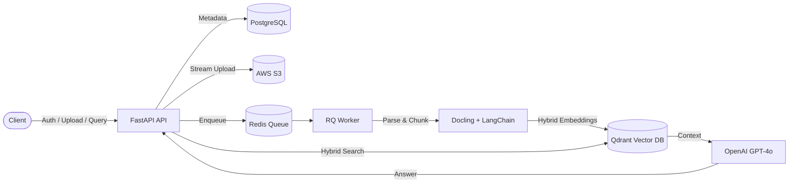

# Financial Intelligence RAG API

A multi-tenant Retrieval-Augmented Generation (RAG) backend API for financial document analysis, featuring layout-aware parsing, hybrid dense + sparse vector search, and asynchronous background indexing.

---

## 🏗 Architecture



---

## ✨ Features

- **Multi-Tenant Isolation**: Dedicated Qdrant collections (`user_{id}_docs`) and segregated S3 folders (`<bucket>/<user_id>/...`) per user.
- **Hybrid Search**: Combines OpenAI dense embeddings (`text-embedding-3-small`) with BM25 sparse vectors for accurate keyword and metric retrieval.
- **Layout-Aware Ingestion**: Parses tables and structured headings using IBM Docling before chunking.
- **Async Processing**: Decouples document parsing and embedding into background workers using Redis Queue (RQ).
- **JWT Authentication**: Secure user registration, login, and token-based route protection.

---

## 🛠 Tech Stack

- **Framework**: FastAPI (Async)
- **Database**: PostgreSQL (SQLAlchemy 2.0 + asyncpg)
- **Vector DB**: Qdrant (Hybrid Dense + BM25)
- **Object Storage**: AWS S3 (`aioboto3`)
- **Queue / Worker**: Redis & RQ
- **LLM / Embeddings**: OpenAI `gpt-4o` & `text-embedding-3-small`
- **Parsing**: IBM Docling & LangChain Splitters

---

## 📁 Project Structure

```text
financial-intelligence-rag-api/
├── app/
│   ├── api/          # Route handlers (auth, upload, query, router)
│   ├── core/         # Config, database, security, and exceptions
│   ├── model/        # Pydantic request/response schemas
│   ├── repo/         # Database access layer
│   ├── schema/       # SQLAlchemy database models
│   ├── services/     # Business logic, Qdrant, chunking, and LLM
│   ├── worker/       # Redis Queue configuration and background tasks
│   └── main.py       # Application entry point & lifespan
├── tests/            # Integration and E2E test suites
├── requirements.txt  # Project dependencies
└── README.md
```

---

## ⚙️ Configuration

Create a `.env` file in the root directory:

```env
# AWS S3
AWS_ACCESS_KEY_ID=your_access_key
AWS_SECRET_ACCESS_KEY=your_secret_key
AWS_REGION=us-east-1
S3_BUCKET_NAME=your_bucket_name

# Qdrant
QDRANT_URL=https://your-qdrant-instance.qdrant.io:6333
QDRANT_API_KEY=your_qdrant_api_key

# PostgreSQL
DB_HOST=localhost
DB_PORT=5432
DB_USER=postgres
DB_PASS=your_password
DB_NAME=financial_rag

# JWT Auth
SECRET_KEY=your_jwt_secret_key
ALGORITHM=HS256
ACCESS_TOKEN_EXPIRE_MINUTES=30
REFRESH_TOKEN_EXPIRE_DAYS=7

# Redis & LLM
REDIS_URL=redis://localhost:6379
OPENAI_API_KEY=your_openai_api_key
```

---

## 🚀 Getting Started

### 1. Install Dependencies

```bash
python -m venv .venv
source .venv/bin/activate
pip install -r requirements.txt
```

### 2. Start Background Worker

```bash
PYTHONPATH=app rq worker documents --url redis://localhost:6379
```

### 3. Start API Server

```bash
PYTHONPATH=app uvicorn app.main:app --reload --port 8000
```

Interactive API documentation will be available at [http://localhost:8000/docs](http://localhost:8000/docs).

---

## 🔌 API Endpoints

| Method | Endpoint | Description | Auth Required |
| :--- | :--- | :--- | :---: |
| `GET` | `/api/v1/health` | Service health check | No |
| `POST` | `/api/v1/auth/signup` | Register new user & initialize vector collection | No |
| `POST` | `/api/v1/auth/login` | Authenticate user & return JWT tokens | No |
| `GET` | `/api/v1/auth/me` | Fetch authenticated user profile | Yes |
| `POST` | `/api/v1/upload/doc/` | Upload document to S3 and queue background ingestion | Yes |
| `POST` | `/api/v1/query/` | Query indexed documents with hybrid RAG pipeline | Yes |

---

## 🧪 Testing

Run the end-to-end integration test suite:

```bash
python tests/test_e2e.py
```
